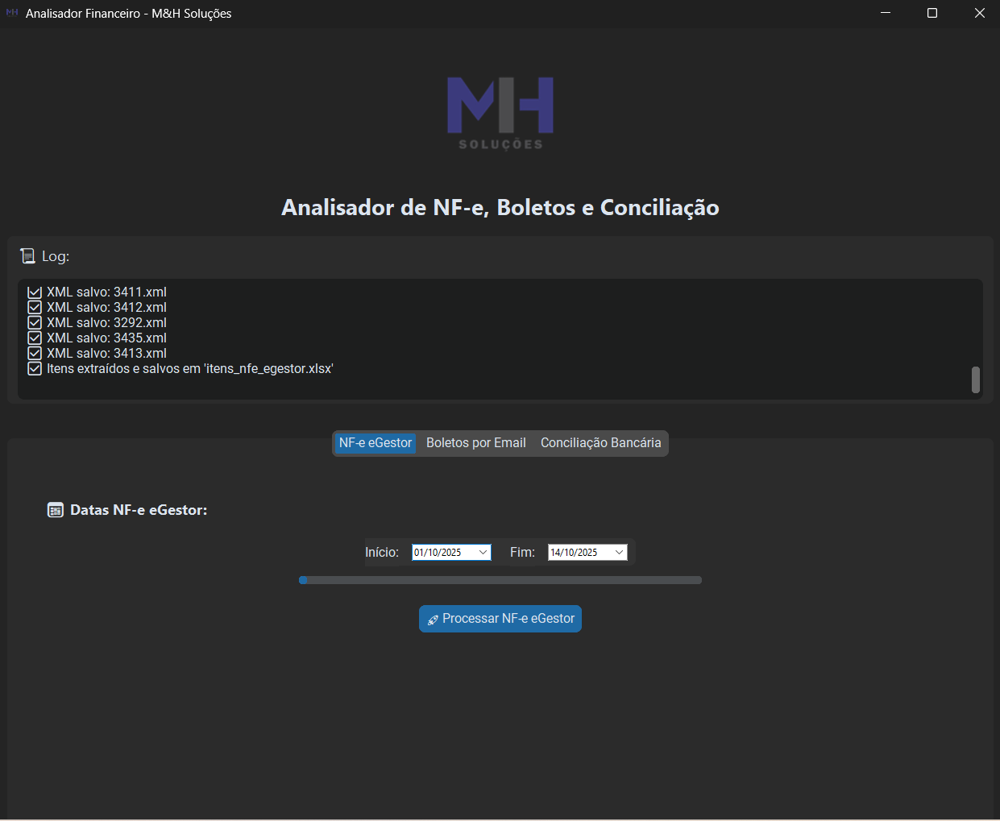
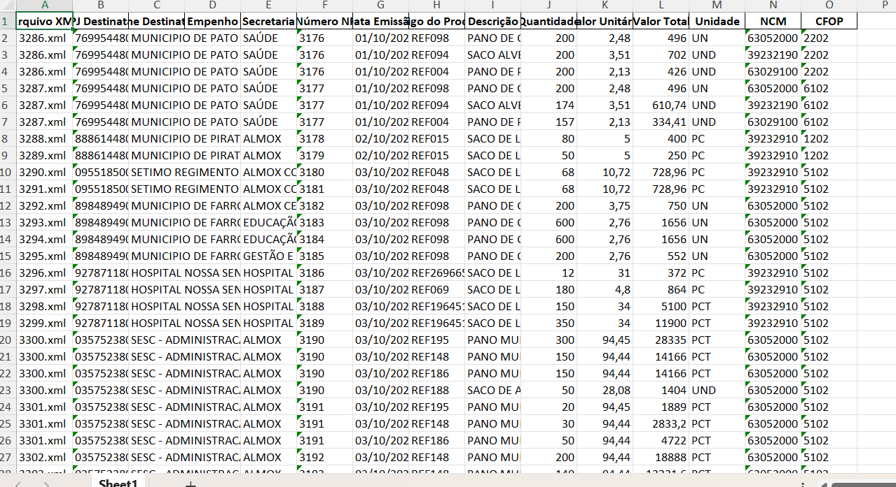

# 🧠 Analisador NFE - M&H Soluções

Sistema para análise automatizada de NF-e, boletos e conciliação bancária.

GUI (CustomTkinter) para:
- baixar NFe do eGestor (token pessoal),
- extrair itens dos XMLs,
- baixar boletos por e-mail (IMAP) e
- conciliar com extratos bancários.

## Requisitos
`python 3.11+`  
`pip install -r requirements.txt`

## Segredos
Configure variáveis de ambiente:
- `EGESTOR_PERSONAL_TOKEN`
- `EMAIL_USER`
- `EMAIL_PASS`

Opcional: `.env` + `python-dotenv`.
# 🧠 Analisador NFE - M&H Soluções

Sistema para análise automatizada de NF-e, boletos e conciliação bancária.

## Rodar

## Estrutura
- `docs/` – screenshots p/ o README
- `xmls/` – (gerado) XMLs baixados
- `pdf_email/` – (gerado) PDFs baixados
